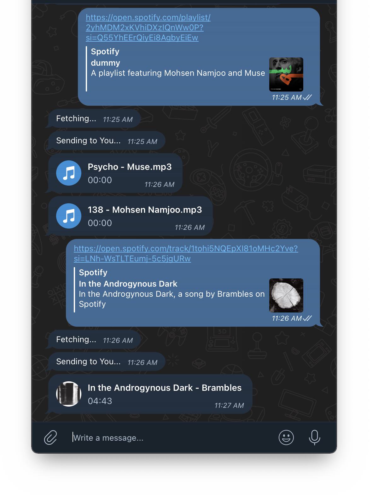

# 🎵 Telegram Spotify Downloader 🦊

<p align="center">
  <a href="https://www.python.org">
    
  </a>
  <a href="https://heroku.com/deploy?template=https://github.com/Tiger-Foxx/Spotify-me">
    
  </a>
  <a href="https://t.me/spotdl_tel_bot">
    
  </a>
  <br>
  <a href="https://github.com/Tiger-Foxx/Spotify-me/stargazers">
    
  </a>
  <a href="https://github.com/Tiger-Foxx/Spotify-me/fork">
    
  </a>  
</p>

## 🦊 Introduction
Un bot Telegram puissant pour télécharger des musiques et playlists Spotify en MP3 directement depuis YouTube. 🎶✨

## 🛠 Prérequis

### Python 3.7 Obligatoire

#### Windows :
1. Télécharger Python 3.7 : [python.org/downloads/release/python-3710](https://www.python.org/downloads/release/python-3710/)
2. Pendant l'installation :
   - Cocher "Add Python to PATH"
   - Choisir "Custom installation"
   - Installer pour tous les utilisateurs

#### Linux :
```bash
sudo apt update
sudo apt install software-properties-common
sudo add-apt-repository ppa:deadsnakes/ppa
sudo apt install python3.7 python3.7-venv
```

#### macOS :
```bash
brew install pyenv
pyenv install 3.7.16
pyenv global 3.7.16
```

## 🚀 Installation Locale

### 1. Cloner le dépôt
```bash
git clone https://github.com/Tiger-Foxx/Spotify-me.git
cd Spotify-me
```

### 2. Créer l'environnement virtuel

#### Windows :
```cmd
py -3.7 -m venv fox_env
fox_env\Scripts\activate
```

#### Linux/macOS :
```bash
python3.7 -m venv fox_env
source fox_env/bin/activate
```

### 3. Mettre à jour pip
```bash
python -m pip install --upgrade pip
```

### 4. Installer les dépendances
```bash
pip install -r requirements.txt
```

### 5. Configuration
Créer un fichier `.env` à la racine :
```env
TELEGRAM_TOKEN=VOTRE_TOKEN_ICI
```

### 6. Lancer le bot
```bash
python main.py
```

## ☁️ Déploiement

### Option 1 : Heroku
1. Cliquer sur ce bouton :  
   [](https://heroku.com/deploy?template=https://github.com/Tiger-Foxx/Spotify-me)
2. Ajouter les variables d'environnement :
   - `TELEGRAM_TOKEN` : Votre token de bot
   - `PYTHON_VERSION` : `3.7.16`

### Option 2 : Render
1. Créer un nouveau Web Service
2. Configurer :
   - Runtime : Python 3.7
   - Build Command : `pip install -r requirements.txt`
   - Start Command : `python main.py`
3. Ajouter les variables d'environnement

### Option 3 : Docker
```bash
docker build -t telegram-spotify-downloader .
docker run -d -e TELEGRAM_TOKEN=VOTRE_TOKEN telegram-spotify-downloader
```

## 🔑 Authentification
Modifier `config.json` :
```json
"AUTH": {
  "ENABLE": true,
  "PASSWORD": "VotreMotDePasse"
}
```

## 🎧 Fonctionnalités
- Téléchargement de :
  - ✅ Chansons individuelles
  - ✅ Albums complets
  - ✅ Playlists entières
  - ✅ Discographies d'artistes

## 🛠 Outils Supportés
- **SpotDL** (Python)
- **SpotifyDL** (JavaScript)

## 📸 Aperçu


## ✅ Roadmap
- [x] Support multi-plateforme
- [x] Déploiement facile
- [x] Affichage progression
- [ ] Interface web

---

🐾 **Développé avec amour par [Tiger-Foxx](https://github.com/Tiger-Foxx) !** 🦊🔥
